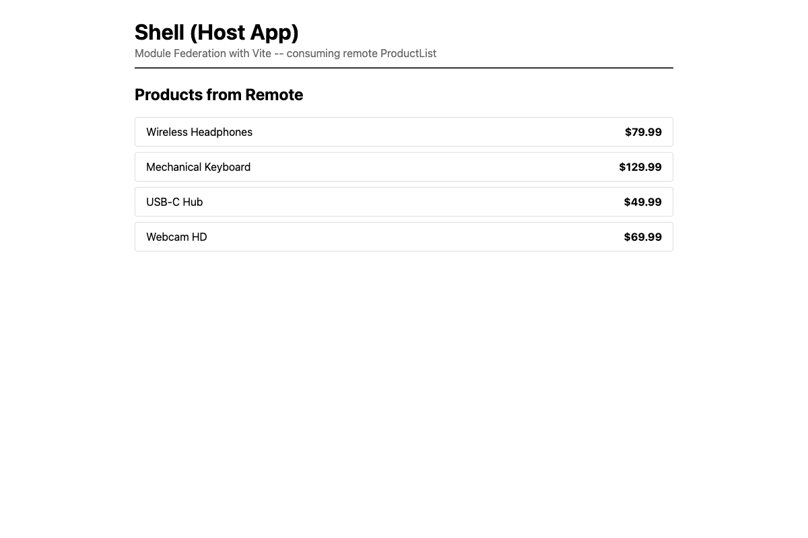
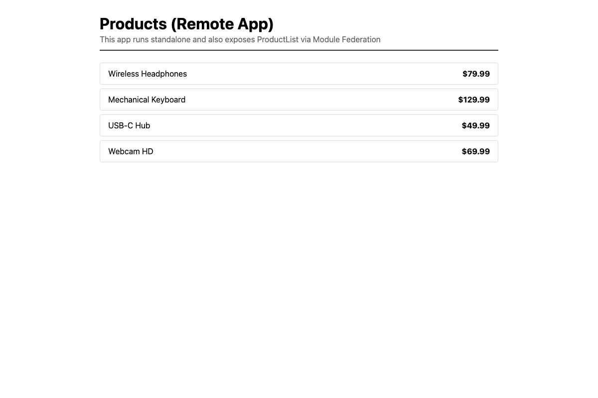

# Module Federation Demo

A minimal Module Federation demo with Vite + React. The **Shell** (host) app loads a `ProductList` component from the **Products** (remote) app at runtime.

## Screenshots

### Shell (Host) — localhost:3000

The host app lazy-loads `ProductList` from the remote at runtime:



### Products (Remote) — localhost:3001

The remote app runs standalone and exposes `ProductList` via Module Federation:



## Architecture

```
┌─────────────────────────────┐        ┌─────────────────────────────┐
│  Shell (Host) :3000         │        │  Products (Remote) :3001    │
│                             │  HTTP  │                             │
│  App.tsx                    │◄───────│  remoteEntry.js             │
│    └─ React.lazy ───────────┼────────┼──► ProductList.tsx          │
│       import("products/     │        │                             │
│              ProductList")  │        │  exposes:                   │
│                             │        │    ./ProductList             │
│  shared: react, react-dom   │◄──────►│  shared: react, react-dom   │
│          (singleton)        │  same  │          (singleton)        │
│                             │  copy  │                             │
└─────────────────────────────┘        └─────────────────────────────┘
```

## Tech Stack

- **Vite** + **React 18** + **TypeScript**
- **@module-federation/vite** — runtime module sharing
- **concurrently** — runs both dev servers in parallel

## Setup

```bash
npm run setup
```

## Usage

```bash
npm run dev
```

- Shell (host): http://localhost:3000
- Products (remote): http://localhost:3001

## How It Works

### 1. Remote exposes modules

The Products app exposes its `ProductList` component:

```ts
// products/vite.config.ts
federation({
  name: "products",
  filename: "remoteEntry.js",
  exposes: {
    "./ProductList": "./src/components/ProductList.tsx",
  },
  shared: {
    react: { singleton: true },
    "react-dom": { singleton: true },
  },
});
```

### 2. Host consumes the remote

The Shell app discovers the Products remote via `remoteEntry.js`:

```ts
// shell/vite.config.ts
federation({
  name: "shell",
  remotes: {
    products: {
      type: "module",
      name: "products",
      entry: "http://localhost:3001/remoteEntry.js",
    },
  },
  shared: {
    react: { singleton: true },
    "react-dom": { singleton: true },
  },
});
```

### 3. Lazy loading

The remote component is imported just like any other module:

```tsx
// shell/src/App.tsx
const ProductList = React.lazy(() => import("products/ProductList"));

<ErrorBoundary>
  <Suspense fallback={<p>Loading remote ProductList...</p>}>
    <ProductList />
  </Suspense>
</ErrorBoundary>
```

### 4. Async boundary

A dynamic import in `main.tsx` is required for shared dependency negotiation:

```ts
// shell/src/main.tsx
import("./bootstrap");
```

This gives Module Federation time to determine which singleton copy of React to use before the app renders.

## Project Structure

```
module-federation-demo/
├── package.json              # Root — runs both apps via concurrently
├── shell/                    # Host app (port 3000)
│   ├── vite.config.ts        # MF host configuration
│   ├── src/
│   │   ├── main.tsx          # Async boundary (import("./bootstrap"))
│   │   ├── bootstrap.tsx     # React root render
│   │   └── App.tsx           # Layout + remote ProductList consumption
│   └── index.html
└── products/                 # Remote app (port 3001)
    ├── vite.config.ts        # MF remote configuration
    ├── src/
    │   ├── main.tsx          # Async boundary
    │   ├── bootstrap.tsx     # Standalone render
    │   └── components/
    │       └── ProductList.tsx  # Exposed component
    └── index.html
```

## Key Concepts

| Concept | Description |
|---------|-------------|
| **Host** | App that consumes modules from remotes |
| **Remote** | App that exposes modules to other apps |
| **remoteEntry.js** | Remote's manifest file — declares available modules |
| **Shared singleton** | Libraries like React are loaded only once and shared |
| **Async boundary** | `import("./bootstrap")` — required for shared dependency negotiation |

## Important Notes

- When Products is independently deployed, Shell does **not** need to be rebuilt
- `singleton: true` ensures only one copy of React is loaded
- If the remote is unavailable, ErrorBoundary catches the error gracefully
- `.__mf__temp/` and `@mf-types/` directories are auto-generated and excluded from git

## Related Article

This demo accompanies the article [Module Federation vs. Single-SPA: Which One, When?](https://zaferayan.com)

---

[Turkce README](./README.tr.md)
